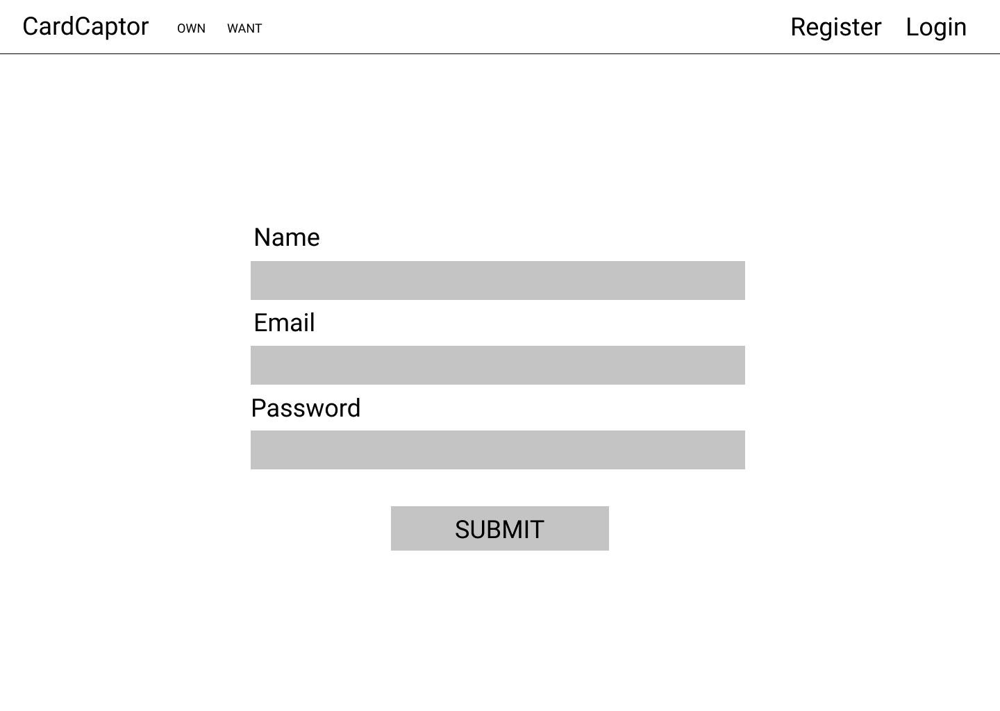
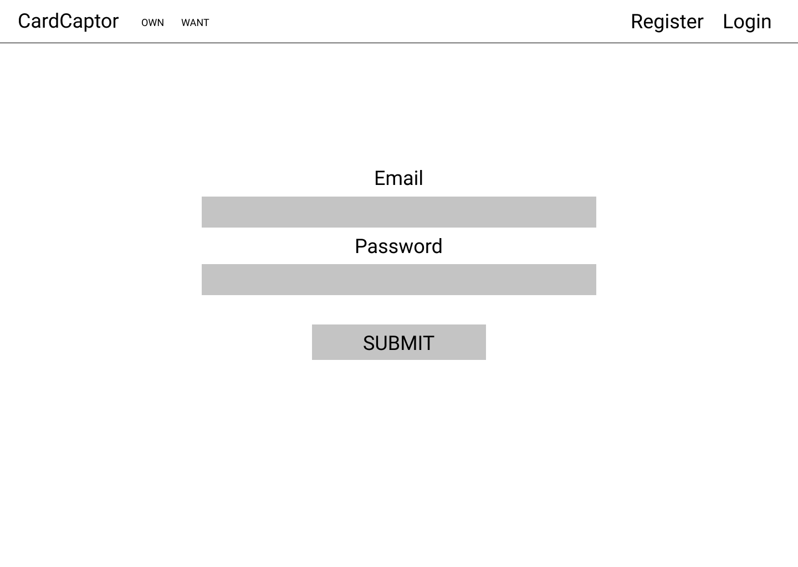

# Card Captor

## About

Keep a catalogue of your Pokemon TCG cards online! As a registered user, you can search for cards you own or want and add them to a database for you to track.

## Installation

1. Visit my github repository [card-captor](https://github.com/tuhoalyhuynh/card_captor)
2. `fork` and `clone` repoository to your local machine.
3. `npm install`
4. `sequelize db:create`
5. `sequelize db:migrate`
6. `node server.js`
7. Visit `localhost:8000` on your browser

### Live Site

[Card Captor](https://card-captor.herokuapp.com/)

## Technologies

* NodeJS
* Javascript
* HTML
* CSS
* 

## Code Snippet

* Homepage
```js
app.get('/', (req, res) => {
  axios.get(`https://api.pokemontcg.io/v1/cards?name=charizard`)
  .then(response => {
      if (response.status === 200){
        res.render('main/index', { 
            cards: response.data.cards,
            alerts: res.locals.alerts
          }
      )}
  })
  .catch(err => {
      console.log(err);
      res.status(400).render('main/404')
  })
});
```

* POST route to add card to owns table and deletes from want table
```js
router.post('/show', isLoggedIn, (req, res) => {
    db.own.findOrCreate({
      where: {
          userId: res.locals.currentUser.id,
          apiId: req.body.apiId,
          name: req.body.name,
          imageUrl: req.body.imageUrl
      }
    })
    .then((own) => {
        db.want.destroy({
            where: {
                userId: res.locals.currentUser.id,
                apiId: own[0].apiId,
                name: own[0].name,
                imageUrl: own[0].imageUrl,
            }
        })
    })
    .then((_project) => {
      res.redirect('/want')
    })
    .catch(err => {
        console.log(err);
        res.status(400).render('main/404')
    })
})
```

## Future Goals

* Various sorting and filtering options for index pages
* Ability to add cards to own/want directly from index without redirecting
* Buy/Sell functionality with eBay API
* Additional trading cards

## Proposal

### User Story

I am a collector of trading cards. I'd like to catalogue the cards that I own. I would also like to keep a catalogue of cards I want.

### Information

Card Captor allows you to catalogue Pokemon TCG (Trading Card Game) Cards that you own and want.

### Wireframe






### ERD

